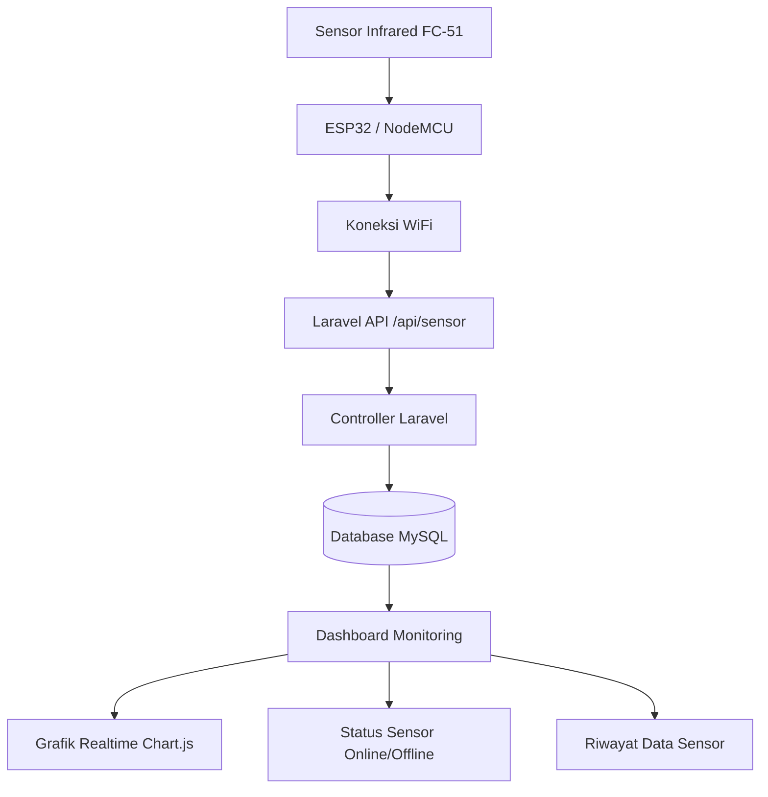

# WebIoT Project

Dashboard monitoring sensor untuk mendeteksi ayunan secara realtime.

## Stack Teknologi
- **Framework:** Laravel 11
- **Styling:** Vite & TailwindCSS
- **Database:** MySQL
- **Integrasi:** API untuk data sensor ESP32

## Flowchart Sistem

## Persiapan Development
1. Clone repositori:
   `git clone https://github.com/MuhammadAmirN/Dashboard_IoT.git`
2. Install dependensi:
   `composer install`
   `npm install`
3. Salin `.env.example` ke `.env` dan atur konfigurasi database.
4. Jalankan migrasi:
   `php artisan migrate`
5. Jalankan server:
   `php artisan serve` & `npm run dev`

## Pengiriman Data Sensor (API)
Gunakan Thunderclient atau Postman untuk testing:
**POST** `https://webiot-production.up.railway.app/api/sensors`

## Lisensi
The Laravel framework is open-sourced software licensed under the [MIT license](https://opensource.org/licenses/MIT).
